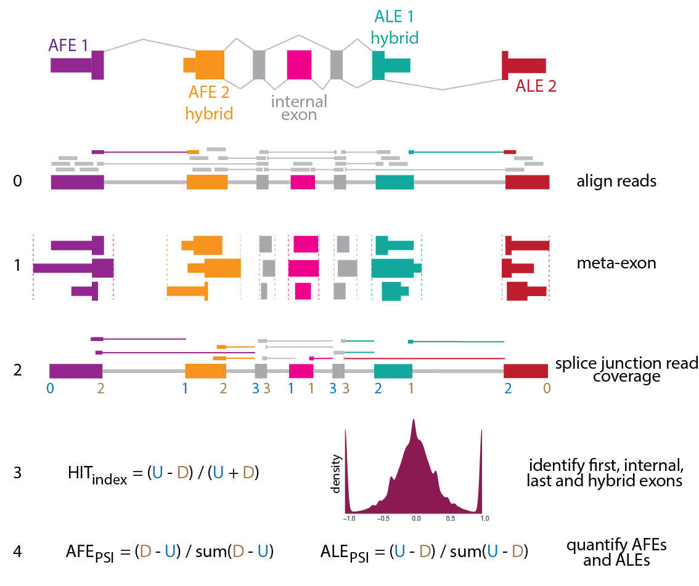
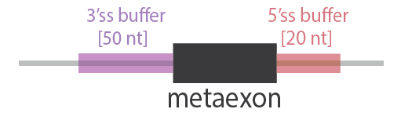
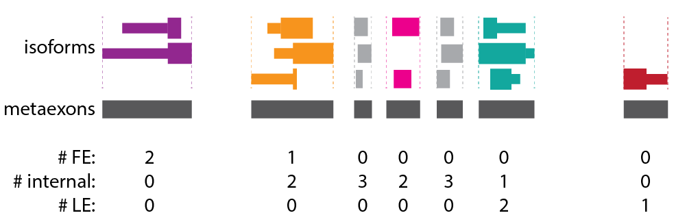
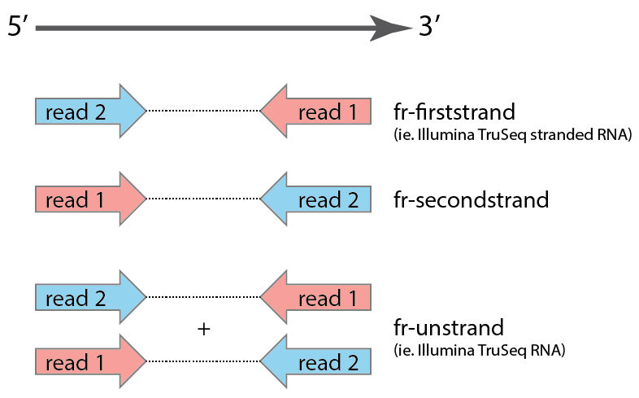

# HITindex

**Citation: Fiszbein A, McGurk M, Calvo Roitberg E, Kim GY, Burge CB, and Pai AA. (2021). The Hybrid-Internal-Terminal (HIT) index uncovers a widespread usage of hybrid exons in human transcriptomes. (submitted)**

The HITindex is a pipeline to classify hybrid, internal, or terminal exons from RNA-seq data by modeling ratios of splice junction coverage. The pipeline involves two major scripts, which can be run independently:

1. HITindex_annotate (Step 1): Annotate metaexons from a gtf file by collapsing overlapping consituent exons. 
2. HITindex_classify (Steps 2-4): Calculate HIT index metrics and classify metaexons into one of 5 exon-types: first, first-internal, internal, internal-last, and last exons. 



### Requirements 

- samtools
- bedtools
- python (v3.6+)

#### Python Dependencies
- scipy (v)
- numpy (v)
- pysam (v)
- pybedtools (v)
- pandas (v)
- pymc3 (v)

## Table of contents
[Overview of HITindex](#overview)

[Sample Tutorial](#tutorial)

[Exon Classification](#classification)

[Alternative First and Last Exon usage](#psi)

## Overview of HITindex

The HITindex was designed to be run on bam files containing mapped reads. Here, we describe the usage of the two main steps of the HITindex pipeline. Below, we provide sections that discuss alternative parameter usage for classification and quantification, as well as a tutorial walking through all the steps necessary to run the HITindex.

### HITindex_annotate
Annotate metaexons from a gtf file by collapsing overlapping consituent exons. This step includes (a) annotating how often a constituent exon is used as a first, internal, or last exon in annotated isoforms, (b) saving the coordinates of each constituent exons, and (c) adding buffer regions in which to associate junction reads with an exon.

```
usage: HITindex_annotate.py [-h] --gtf gtf [--reverse] [--ss3buffer] [--ss5buffer] 
                                 --outfile output

optional arguments:
  -h, --help            show this help message and exit

Input:
  --gtf gtf             gtf to be indexed (default: None)

Parameters:
  --reverse             use if exons are sorted by transcriptional direction rather than by reference
                        coordinate (default: False)
  --ss3buffer           intronic buffer region included upstream of 3ss of exon for counting
                        reads. suggested = 50nt. (default: 0)
  --ss5buffer           intronic buffer region included downstream of 5ss of exon for counting
                        reads. suggested = 20nt. (default: 0)

Output:
  --outfile output  name for output bed with merged/annotated exons (default: None)
```

### HITindex_classify
Calculate HIT index metrics and classify metaexons into one of 5 exon-types: first, first-internal, internal, internal-last, and last exons. This step includes (a) calculating the HITindex and generative model metrics, (b) flagging exons likely affected by edge effects, (c) classifying exons, and (d) calculating PSI values for alternative first and last exon usage.

```
usage: HITindex [-h] [--junctionReads] [--HITindex] [--identifyTerminal] [--calculatePSI] 
                      --outname output [--bam] [--juncbam] [--readtype {single,paired}]
                     [--readstrand {fr-unstrand,fr-firststrand,fr-secondstrand}] [--bed] [--overlap]
                     [--readnum] [--bootstrap] [--metrics] [--parameters] [--metricsID] [--edge]

optional arguments:
  -h, --help            show this help message and exit
  --junctionReads       Extract junction reads (default: False)
  --HITindex            Calculate HITindex (default: False)
  --identifyTerminal    Identify terminal, hybrid, and internal exons (default: False)
  --calculatePSI        Calculate PSI values (default: False)
  --outname output      name of file(s) for final metric. (default: None)

read information:
  --bam                 original bam from which to extract junction reads. required if
                        --junctionReads (default: None)
  --juncbam             junction read bam. required if --junctionReads or --HITindex (default:
                        None)
  --readtype {single,paired}
                        type of read (default: paired)
  --readstrand {fr-unstrand,fr-firststrand,fr-secondstrand}
                        directionality of RNA-seq data (default: fr-firststrand)

exon information:
  --bed                 bed file with merged/annotated exons. Output from HITindex_annotate.py.
                        required if --HITindex (default: None)

HIT:
  parameters for running HIT index

  --overlap             overlap of split read with exon region (nt) (default: 10)
  --readnum             minimum number of reads for confidence in HITindex (sum of R + L) (default:
                        2)
  --bootstrap           bootstrapping iterations to get p-value for metric confidence (within 0.1)
                        (default: 1000)

identify:
  information for identifying exon types

  --metrics             HITindex output file, required if --HITindex is not specified. (default:
                        None)
  --parameters          file specifying HITindex and generative model thresholds for identifying
                        exons. (default: HIT_identity_parameters.txt)

psi:
  parameters for calling PSI values

  --metricsID           HITindex identification output file, required if --identifyTerminal is not
                        specified. (default: None)
  --edge                exclude exons flagged as being affected by the edge effect from PSI
                        calculations (default: False)
```

## Tutorial on running HITindex

make figure: steps (inputs + outputs) in bubble form

### Step 0: Genome Alignment

Align raw reads in fastq format to the genome with your favorite splicing-aware mapper (ie. STAR | hisat2) to obtain a sorted, indexed bam file. When building a STAR index or running hisat2, we recommend using the same gtf annotation that you will use for downstream steps.

For instance, to map with STAR (using ENCODE parameters) and index the bam:
```
STAR --outFilterType BySJout --outFilterMultimapNmax 20 --alignSJoverhangMin 8 --alignSJDBoverhangMin 1 --outFilterMismatchNmax 999 --outFilterMismatchNoverLmax 0.04 --alignIntronMin 20 --alignIntronMax 1000000 --alignMatesGapMax 1000000 --outSAMtype BAM SortedByCoordinate

samtools index [bamfile].bam
```

### Identify & Annotate metaexons (Step 1)

This step takes in an annotation file (gtf file) and outputs a bed file of metaexons after collapsing and annotating overlapping exons.

Example usage:
```
python HITindex_annotate.py --gtf annotations.gtf --ss3buffer 50 --ss5buffer 20 --outfile metaexons.bed
```

**Types of GTF files**

(1) Exons in gtf are sorted by genome coordinates (default):

```
1       havana  gene    11869   14409   .       +       .       gene_id "ENSG00000223972"; gene_name "DDX11L1"; 
1       havana  transcript      11869   14409   .       +       .       gene_id "ENSG00000223972"; transcript_id "ENST00000456328"; gene_name "DDX11L1";
1       havana  exon    11869   12227   .       +       .       gene_id "ENSG00000223972"; transcript_id "ENST00000456328"; exon_number "1"; gene_name "DDX11L1";
1       havana  exon    12613   12721   .       +       .       gene_id "ENSG00000223972"; transcript_id "ENST00000456328"; exon_number "2"; gene_name "DDX11L1";
1       havana  exon    13221   14409   .       +       .       gene_id "ENSG00000223972"; transcript_id "ENST00000456328"; exon_number "3"; gene_name "DDX11L1";
1       havana  gene    34554   36081   .       -       .       gene_id "ENSG00000237613"; gene_name "FAM138A"; 
1       havana  transcript      34554   36081   .       -       .       gene_id "ENSG00000237613"; transcript_id "ENST00000417324"; gene_name "FAM138A";
1       havana  exon    34554   35174   .       -       .       gene_id "ENSG00000237613"; transcript_id "ENST00000417324"; exon_number "3"; gene_name "FAM138A";
1       havana  exon    35277   35481   .       -       .       gene_id "ENSG00000237613"; transcript_id "ENST00000417324"; exon_number "2"; gene_name "FAM138A";
1       havana  exon    35721   36081   .       -       .       gene_id "ENSG00000237613"; transcript_id "ENST00000417324"; exon_number "1"; gene_name "FAM138A";
```

(2) Exons in gtf are sorted by transcriptional direction (use ```--reverse```):

```
1       havana  gene    11869   14409   .       +       .       gene_id "ENSG00000223972"; gene_name "DDX11L1"; 
1       havana  transcript      11869   14409   .       +       .       gene_id "ENSG00000223972"; transcript_id "ENST00000456328"; gene_name "DDX11L1";
1       havana  exon    11869   12227   .       +       .       gene_id "ENSG00000223972"; transcript_id "ENST00000456328"; exon_number "1"; gene_name "DDX11L1";
1       havana  exon    12613   12721   .       +       .       gene_id "ENSG00000223972"; transcript_id "ENST00000456328"; exon_number "2"; gene_name "DDX11L1";
1       havana  exon    13221   14409   .       +       .       gene_id "ENSG00000223972"; transcript_id "ENST00000456328"; exon_number "3"; gene_name "DDX11L1";
1       havana  gene    34554   36081   .       -       .       gene_id "ENSG00000237613"; gene_name "FAM138A"; 
1       havana  transcript      34554   36081   .       -       .       gene_id "ENSG00000237613"; transcript_id "ENST00000417324"; gene_name "FAM138A";
1       havana  exon    35721   36081   .       -       .       gene_id "ENSG00000237613"; transcript_id "ENST00000417324"; exon_number "1"; gene_name "FAM138A";
1       havana  exon    35277   35481   .       -       .       gene_id "ENSG00000237613"; transcript_id "ENST00000417324"; exon_number "2"; gene_name "FAM138A";
1       havana  exon    34554   35174   .       -       .       gene_id "ENSG00000237613"; transcript_id "ENST00000417324"; exon_number "3"; gene_name "FAM138A";
```

**Buffer regions around metaexons**

Users can chose to add a buffer region around metaexon boundaries within which to associate junction reads to a particular metaexon. This is meant to account for some flexibility in TSS and TES definitions, which are often hard to precisely define and thus less likely to be precise at the single nucleotide level in annotation sets. While the default is set to 0nt for both the 5' and 3' buffer regions, we suggest 50nt buffer at the 5' end and 20nt buffer at the 3' end:



**Metaexon annotations**

Two bed files are output, one with precise metaexon boundaries and the second with boundaries defined by the user-defined buffer regions. Both include additional information in the 4th column, including (1) the constitutent overlapping exons that were combined to create the metaexon and (2) how many times constituent exons are first, internal, or last exons within annotated isoforms from the gtf file, as shown here:



Example output:
```
xxx
```

### Classify & Quantitate Exons

- full script running

#### Extracting Junction Reads (Step 2)

Junction reads are extracted by parsing the CIGAR strings of mapped reads. To correctly assign junction reads the user needs to provide information about read type (single or paired end reads) and the strandedness of the reads, which is determined by library type used. We borrow the library strandedness naming convention from Tophat/Bowtie:



- how to run just junction reads

#### Exon Classification (Step 3)
- overlap figure
- minimum read num
- bootstrapping

#### Exon Quantification (Step 4)
- edge effect

## Exon Classification

- how to run just this
- rerunning after running previous steps

## Alternative First and Last Exon Usage

- how to run just this
- rerunning after running previous steps
- edge effects figure, meaning
