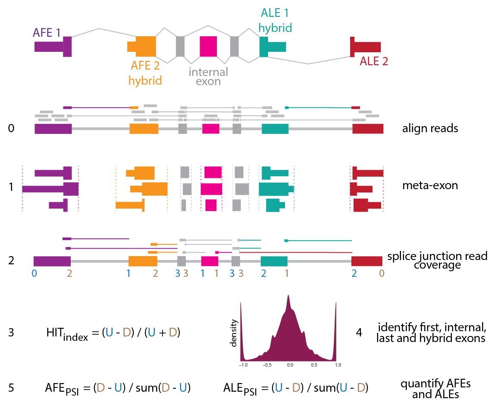

# HITindex

**Citation: Fiszbein A, McGurk M, Calvo Roitberg E, Kim GY, Burge CB, and Pai AA. (2021). The Hybrid-Internal-Terminal (HIT) index uncovers a widespread usage of hybrid exons in human transcriptomes. (submitted)**

The HITindex is a pipeline to classify hybrid, internal, or terminal exons from RNA-seq data by modeling ratios of splice junction coverage. The pipeline involves two major scripts, which can be run independently:

1. HITindex_annotate: Annotate metaexons from a gtf file by collapsing overlapping consituent exons. 
2. HITindex_classify: Calculate HIT index metrics and classify metaexons into one of 5 exon-types: first, first-internal, internal, internal-last, and last exons. 

### Requirements 

- samtools
- bedtools
- python (v3.6+)

#### Python Dependencies
- scipy (v)
- numpy (v)
- pysam (v)
- pybedtools (v)
- pandas (v)
- pymc3 (v)

## Table of contents
[Overview of HITindex](#overview-of-hitindex)

[Detailed Tutorial](#detailed-tutorial-to-run-the-hitindex)


## Overview of HITindex

The HITindex was designed to be run on bam files containing mapped reads. Here, we describe the usage of the two main steps of the HITindex pipeline. Below, we provide sections that discuss alternative parameter usage for classification and quantification, as well as a tutorial walking through all the steps necessary to run the HITindex.

<p align="center">

</p>

### HITindex_annotate
Annotate metaexons from a gtf file by collapsing overlapping consituent exons. This step includes (a) annotating how often a constituent exon is used as a first, internal, or last exon in annotated isoforms, (b) saving the coordinates of each constituent exons, and (c) adding buffer regions in which to associate junction reads with an exon.

```
usage: HITindex_annotate.py [-h] --gtf gtf [--reverse] [--ss3buffer] [--ss5buffer] 
                                 --outfile output

optional arguments:
  -h, --help            show this help message and exit

Input:
  --gtf gtf             gtf to be indexed (default: None)

Parameters:
  --reverse             use if exons are sorted by transcriptional direction rather than by reference
                        coordinate (default: False)
  --ss3buffer           intronic buffer region included upstream of 3ss of exon for counting
                        reads. suggested = 50nt. (default: 0)
  --ss5buffer           intronic buffer region included downstream of 5ss of exon for counting
                        reads. suggested = 20nt. (default: 0)

Output:
  --outfile output      name for output bed with merged/annotated exons (default: None)
```

### HITindex_classify
Calculate HIT index metrics and classify metaexons into one of 5 exon-types: first, first-internal, internal, internal-last, and last exons. This step includes (a) calculating the HITindex and generative model metrics, (b) flagging exons likely affected by edge effects, (c) classifying exons, and (d) calculating PSI values for alternative first and last exon usage.

```
usage: HITindex_classify.py [-h] [--junctionReads] [--HITindex] [--identifyTerminal] [--calculatePSI] 
                                  --outname output [--bam] [--juncbam] [--readtype {single,paired}]
                                 [--readstrand {fr-unstrand,fr-firststrand,fr-secondstrand}] [--bed] [--overlap]
                                 [--readnum] [--bootstrap] [--metrics] [--parameters] [--metricsID] [--edge]

optional arguments:
  -h, --help            show this help message and exit
  --junctionReads       Extract junction reads (default: False)
  --HITindex            Calculate HITindex (default: False)
  --classify            Classify terminal, hybrid, and internal exons (default: False)
  --calculatePSI        Calculate PSI values (default: False)
  --outname             name of file(s) for final metric. required for everything except --junctionReads. (default: None)

read information:
  --bam                 original bam from which to extract junction reads. required if
                        --junctionReads (default: None)
  --juncbam             junction read bam. required if --junctionReads or --HITindex (default:
                        None)
  --readtype {single,paired}
                        type of read (default: paired)
  --readstrand {fr-unstrand,fr-firststrand,fr-secondstrand}
                        directionality of RNA-seq data (default: fr-firststrand)

exon information:
  --bed                 bed file with merged/annotated exons. Output from HITindex_annotate.py.
                        required if --HITindex (default: None)

HITindex:
  parameters for running HIT index

  --overlap             overlap of split read with exon region (nt) (default: 10)
  --readnum             minimum number of reads for confidence in HITindex (sum of R + L) (default:
                        2)
  --bootstrap           bootstrapping iterations to get p-value for metric confidence (within 0.1)
                        (default: 1000)

classify:
  information for identifying exon types

  --metrics             HITindex output file, required if --HITindex is not specified. (default:
                        None)
  --parameters          file specifying HITindex and generative model thresholds for classifying
                        exons. (default: HIT_identity_parameters.txt)

psi:
  parameters for calling PSI values

  --metricsID           HITindex identification output file, required if --classify is not
                        specified. (default: None)
  --edge                exclude exons flagged as being affected by the edge effect from PSI
                        calculations (default: False)
```

## Detailed Tutorial to run the HITindex

make figure: steps (inputs + outputs) in bubble form

### Jump to a step:
[Step 0: Genome Alignment](#step-0-genome-alignment)

[Step 1: Identify and Annotate Metaexons](#step-1-identify-and-annotate-metaexons)

[Step 2: Extracting Junction Reads](#step-2-extracting-junction-reads)

[Step 3: Calculating HITindex metrics](#step-3-calculating-hitindex-metrics)

[Step 4: Exon Classification](#step-4-exon-classification)

[Step 5: Exon Quantification](#step-5-exon-quantification)

### Step 0: Genome Alignment

Align raw reads in fastq format to the genome with your favorite splicing-aware mapper (ie. STAR | hisat2) to obtain a sorted, indexed bam file. When building a STAR index or running hisat2, we recommend using the same gtf annotation that you will use for downstream steps.

For instance, to map with STAR (using ENCODE parameters) and index the bam:
```
STAR --outFilterType BySJout --outFilterMultimapNmax 20 --alignSJoverhangMin 8 --alignSJDBoverhangMin 1 --outFilterMismatchNmax 999 --outFilterMismatchNoverLmax 0.04 --alignIntronMin 20 --alignIntronMax 1000000 --alignMatesGapMax 1000000 --outSAMtype BAM SortedByCoordinate

samtools index [bamfile].bam
```

### Step 1: Identify and Annotate Metaexons

This step takes in an annotation file (gtf file) and outputs a bed file of metaexons after collapsing and annotating overlapping exons.

Example usage:
```
python HITindex_annotate.py --gtf annotations.gtf --ss3buffer 50 --ss5buffer 20 --outfile metaexons.bed
```

**Types of GTF files**

(1) Exons in gtf are sorted by genome coordinates (default):

```
1       havana  gene    11869   14409   .       +       .       gene_id "ENSG00000223972"; gene_name "DDX11L1"; 
1       havana  transcript      11869   14409   .       +       .       gene_id "ENSG00000223972"; transcript_id "ENST00000456328"; gene_name "DDX11L1";
1       havana  exon    11869   12227   .       +       .       gene_id "ENSG00000223972"; transcript_id "ENST00000456328"; exon_number "1"; gene_name "DDX11L1";
1       havana  exon    12613   12721   .       +       .       gene_id "ENSG00000223972"; transcript_id "ENST00000456328"; exon_number "2"; gene_name "DDX11L1";
1       havana  exon    13221   14409   .       +       .       gene_id "ENSG00000223972"; transcript_id "ENST00000456328"; exon_number "3"; gene_name "DDX11L1";
1       havana  gene    34554   36081   .       -       .       gene_id "ENSG00000237613"; gene_name "FAM138A"; 
1       havana  transcript      34554   36081   .       -       .       gene_id "ENSG00000237613"; transcript_id "ENST00000417324"; gene_name "FAM138A";
1       havana  exon    34554   35174   .       -       .       gene_id "ENSG00000237613"; transcript_id "ENST00000417324"; exon_number "3"; gene_name "FAM138A";
1       havana  exon    35277   35481   .       -       .       gene_id "ENSG00000237613"; transcript_id "ENST00000417324"; exon_number "2"; gene_name "FAM138A";
1       havana  exon    35721   36081   .       -       .       gene_id "ENSG00000237613"; transcript_id "ENST00000417324"; exon_number "1"; gene_name "FAM138A";
```

(2) Exons in gtf are sorted by transcriptional direction (use ```--reverse```):

```
1       havana  gene    11869   14409   .       +       .       gene_id "ENSG00000223972"; gene_name "DDX11L1"; 
1       havana  transcript      11869   14409   .       +       .       gene_id "ENSG00000223972"; transcript_id "ENST00000456328"; gene_name "DDX11L1";
1       havana  exon    11869   12227   .       +       .       gene_id "ENSG00000223972"; transcript_id "ENST00000456328"; exon_number "1"; gene_name "DDX11L1";
1       havana  exon    12613   12721   .       +       .       gene_id "ENSG00000223972"; transcript_id "ENST00000456328"; exon_number "2"; gene_name "DDX11L1";
1       havana  exon    13221   14409   .       +       .       gene_id "ENSG00000223972"; transcript_id "ENST00000456328"; exon_number "3"; gene_name "DDX11L1";
1       havana  gene    34554   36081   .       -       .       gene_id "ENSG00000237613"; gene_name "FAM138A"; 
1       havana  transcript      34554   36081   .       -       .       gene_id "ENSG00000237613"; transcript_id "ENST00000417324"; gene_name "FAM138A";
1       havana  exon    35721   36081   .       -       .       gene_id "ENSG00000237613"; transcript_id "ENST00000417324"; exon_number "1"; gene_name "FAM138A";
1       havana  exon    35277   35481   .       -       .       gene_id "ENSG00000237613"; transcript_id "ENST00000417324"; exon_number "2"; gene_name "FAM138A";
1       havana  exon    34554   35174   .       -       .       gene_id "ENSG00000237613"; transcript_id "ENST00000417324"; exon_number "3"; gene_name "FAM138A";
```

**Buffer regions around metaexons**

Users can chose to add a buffer region around metaexon boundaries within which to associate junction reads to a particular metaexon. This is meant to account for some flexibility in TSS and TES definitions, which are often hard to precisely define and thus less likely to be precise at the single nucleotide level in annotation sets. While the default is set to 0nt for both the 5' and 3' buffer regions, we suggest using ```--ss5buffer 50``` for a 50nt buffer at the 5' end and ```--ss3buffer 20``` for a 20nt buffer at the 3' end:

<p align="center">

</p>

**Metaexon annotations**

Three bed files are output: </br>
(1) Precise metaexon boundaries
(2) Boundaries defined by the user-defined buffer regions 
(3) Associating metaexon names with the coordinates of the constitutent overlapping exons that were combined to create the metaexon 

The first two bed files include additional information in the 4th column about how many times constituent exons are first, internal, or last exons within annotated isoforms from the gtf file, as shown here:

<p align="center">

</p>

Example output:
```
xxx
```

### Classify and Quantitate Exons

Example usage using default parameters to run all 4 steps in tandem:
```
python HITindex_classify.py --junctionReads --bam sample.sorted.bam --juncbam sample.sorted.junctions.bam 
                            --HITindex --bed metaexon.bed_ss3-20ss5-50.buffer 
                            --classify --calculatePSI 
                            --outname sampleHITindex   
```

### Step 2: Extracting Junction Reads

To only extract junction reads:
```
python HITindex_classify.py --junctionReads --bam sample.sorted.bam --juncbam sample.sorted.junctions.bam --readtype paired --readstrand fr-firststrand 
```

Junction reads are extracted by parsing the CIGAR strings of mapped reads. To correctly assign junction reads the user needs to provide information about read type and strandedness of the reads: </br>
(1) Read type can be changed with ```--readtype``` with option {single or paired}, default: paired </br>
(2) Strandedness of the reads can be changed with ```--readstrand``` with options {fr-firststrand, fr-secondstrand, fr-unstrand}, default: fr-firststrand 

Strandedness is determined by the type of library preparation protocol. We borrow the library strandedness naming convention from Tophat/Bowtie:

<p align="center">

</p>

**Output**

This step results in bam files containing only the junction reads, named using ```--juncbam```. These junction bam files can be specified in later steps, without needing to re-run ```--junctionReads``` to extract junction reads again.

### Step 3: Calculating HITindex metrics

To only calculate HITindex metrics and run the generative model:
```
python HITindex_classify.py --HITindex --juncbam sample.sorted.junctions.bam --readtype paired --readstrand fr-firststrand --bed metaexon.bed_ss3-20ss5-50.buffer  --overlap 10 --readnum 5 --bootstrap 1000 --outname sampleHITindex
```

Junction reads are assigned to metaexons based on their overlap with the upstream or downstream boundaries of the metaexon. Note that the junction site does not need to be directly aligned with the exact metaexon boundary coordinates and junction reads are counted regardless of the identity of the connected exon. The minimum overlap length for junction reads is determined by ```--overlap```, with a default of 10nt. 

<p align="center">

</p>

The HITindex and generative model probabilities are calculated for metaexons that have a minimum number of reads as determined by ```--readnum```, with a default of 2 reads. For datasets with sufficient coverage, we recommend using at least 5 reads.

**Bootstrapping**

Bootstrapping is used to calculate two different statistical metrics related to the HITindex metric. The number of bootstrap iterations used is determined by ```--bootstrap```, with a default of 1000 runs. This is the rate-limiting step for the HITindex pipeline, so we recommend running this step once and then using the output to fine-tune exon classification and PSI quantification. Reducing the bootstrap n will increase speed, but decrease statistical confidence.

**Output**

This step results in a ```.exon``` file with the following columns:

| Column Name | Description |
| ----------- | ----------- |
| exon | exon name, with coordinates of metaexon |
| gene   | gene name (from GTF file) |
| strand | strand |
| nTXPT | total number of annotated isoforms for the gene |
| nFE, nINTERNAL, nLE, nSINGLE | number of times constituent exons of this metaexon are annotated as first, internal, or last exons, or appear as a single exon isoform |
| nUP, nDOWN | number of upstream and downstream splice junction reads |
| HITindex | HITindex
| boot_pval | bootstrapping p-value, indicating probability of observing, at random, value within 0.1 of true HITindex |
| CI75_low, CI75_high | 75% confidence intervals, using bootstrapped iterations |
| CI90_low, CI90_high | 90% confidence intervals, using bootstrapped iterations |
| CI95_low, CI95_high | 95% confidence intervals, using bootstrapped iterations |
| dist_to_TSS | metaexon distance to upstream most expressed exon |
| dist_to_TES | metaexon distance to downstream most expressed exon |
| edge | flag indicating whether metaexon is likely to be influenced by edge effects |
| PofF, PofI, PofL | generative model posterior probabilities for first, internal, and last exon classifications |
| PofFI, PofIL | generative model posterior probabilities for hybrid exon classifications | 
| downstream_fraction | |
| FIL_postmean | |

### Step 4: Exon Classification

To only classify exons:
```
python HITindex_classify.py --classify  --metrics sampleHITindex.exon --paramters HIT_identity_parameters.txt
```

Exons are classified using the ```.exon``` file output from the last step and the included ```HIT_identity_parameters.txt``` file (reproduced below), which defines the thresholds used across the HITindex metric, statistical confidence metrics, and posterior probabilities from the generative model that are used to classify exons. Users can change these thresholds by changing the values in the ```HIT_identify_parameters.txt``` or create custom files with the same format. Custom files can be specified using ```--parameters```.

HIT_identity_parameters file:
```
# |HITindex| threshold for calling terminal exons [0.0, 1.0]
HITterminal	1.0
# |HITindex| threshold for calling hybrid exons [0.0, 1.0]
HIThybrid	0.3
# bootstrapping p-value threshold for HITindex significance [0.0, 1.0]
HITpval	1
# confidence interval to use for HITindex significance (none, 0.75, 0.95, 0.95)
HIT_CI	none
# probability threshold for medium confidence with generative model [0.0, 1.0]
prob_med	0.5
# probability threshold for high confidence with generative model [0.0, 1.0]
prob_high	0.8
```

**Output**

This step adds two columns to the existing ```.exon``` file: </br>
(1) ```ID``` the exon-type classification </br>
(2) ```ID_position``` the exon-type classification after accounting for potential edge effect exons

Users can run this step multiple times with varying thresholds, but since the original file is modified, we suggest duplicating the ```.exon``` file for each set of thresholds and then specifying the new ```.exon``` files with ```--metrics```. 

### Step 5: Exon Quantification

To only calculate PSI values:
```
python HITindex_classify.py --calculatePSI  --metricsID sampleHITindex.exon --edge --outname sampleHITindex
```

Percent spliced in (PSI) values are used to quantify relative alternative terminal exon usage. Exons classified as "first", "FirstInternal_medium" or "FirstInternal_high" are used to calculate alternative first exon (AFE) PSI values, while exons classified as “last”, “InternalLast_medium” or “InternalLast_high” are used to calculate PSI values for alternative last exon (ALE) usage. If the user includes the ```--edge``` flag, exons flagged as potentially being affected by edge-effects in the ```ID_position``` column of the ```.exon``` file are not included in the PSI value calculations. Since this step uses the exon classifications in the previous step, it must be run on an ```.exon``` file that has the ```ID``` and ```ID_position``` columns. 

**Output**

This step results in ```.AFEPSI``` and ```.ALEPSI``` files with the following columns:

| Column Name | Description |
| ----------- | ----------- |
| gene   | gene name (from GTF file) |
| exon | exon name, with coordinates of metaexon |
| strand | strand |
| nTXPT | total number of annotated isoforms for the gene |
| nFE or nLE | number of times constituent exons of this metaexon are annotated as first, internal, or last exons, or appear as a single exon isoform |
| nUP, nDOWN | number of upstream and downstream splice junction reads |
| HITindex | HITindex |
| sumR-L or sumL-R | sum of all read biases across all alternative exons |
| AFEPSI or ALEPSI | PSI value for metaexon |

Users can run this step multiple times by using the ```--metricsID``` to specify different ```.exon``` files or varying the ```--edge``` flag, but should make sure to change the ```--outname``` for each of these runs. 
